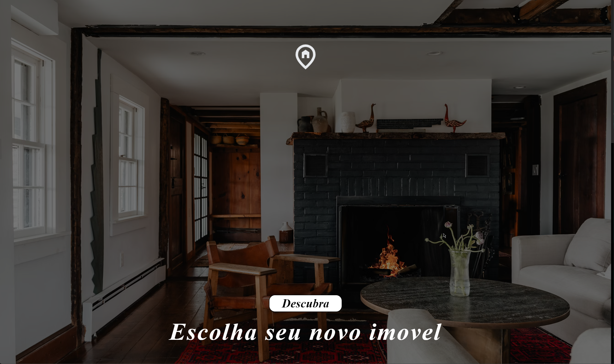
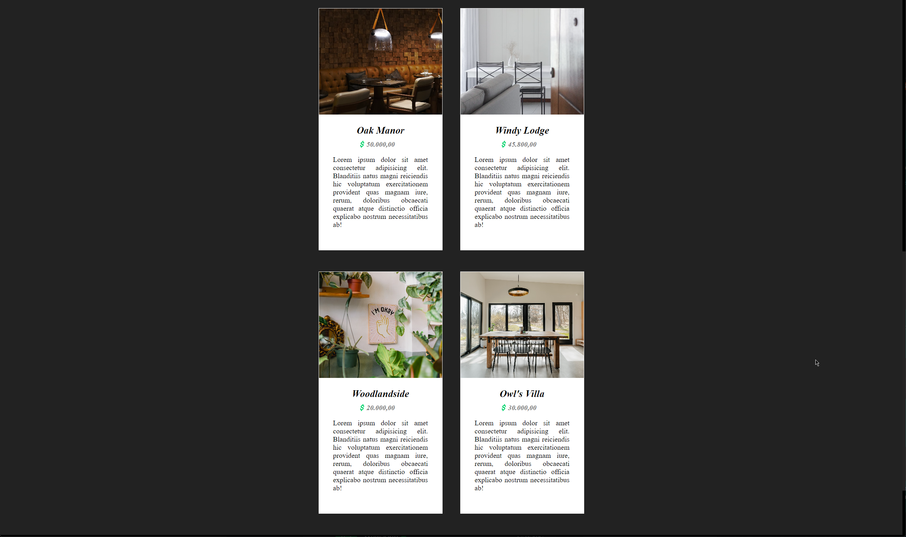
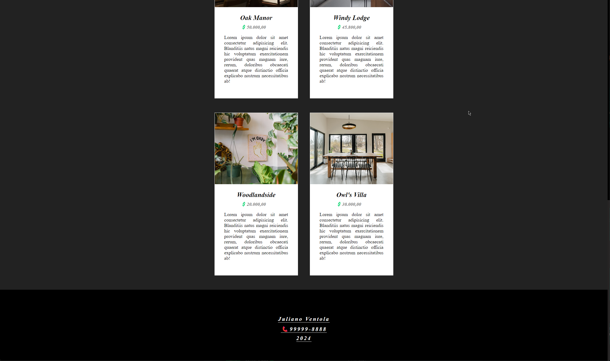

# Escolhendo Imóveis

<h1 align="center">
  
Acessar <a href="https://julianoventola.github.io/proprieties-rent/">aqui</a>

  
  
  
</h1>
 
- Projeto desenvolvido com intuito de demonstrar 4 tipo de "imóveis para alugar/comprar" e ver as imagens,
  utilizando o mais básico HTML e CSS
- O site não é responsível justamente por usar uma parte básica das tecnologias

## Como utilizar

- Você pode clonar o repositório
- Abrir o arquivo index.html

## Extras

- Licença MIT
- As imagens utilizadas foram retiradas o site [unsplash](https://unsplash.com/pt-br)
